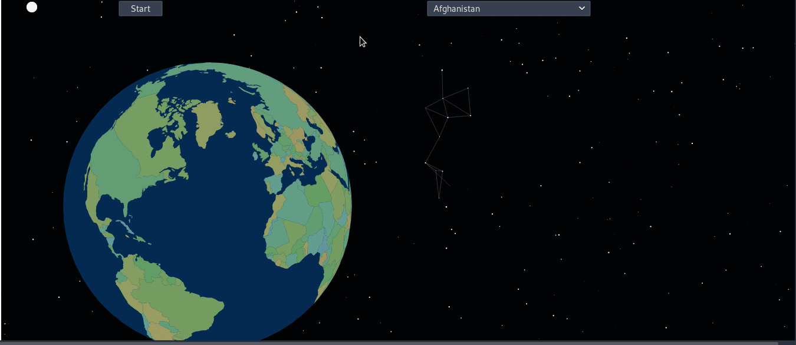

# National Animals Data Visualisation

## Introduction

The Main Objective of this project was to take unstructured data in the form of an HTML page, in this case a Wikipedia page found [here](https://en.wikipedia.org/wiki/List_of_national_animals) and display the data in an interactive way.

It involved scraping, parsing, storing, sending and displaying data in [JSON](https://www.json.org/) format.

There are ofcousre more efficient and better ways to obtain data from [Wikipedia](https://en.wikipedia.org/w/api.php?action=parse&page=Flag_of_Ireland&format=json).

However that was not the purpose of the project.

## Documentation

- [Module API Documentation](https://github.com/harps116/national-animals-data-vis)

### Data visualisation

- [Raw Data](https://raw.githubusercontent.com/harps116/national-animals/master/web_scraper/national_animals_map.topojson)

- [Interactive Globe](https://projects.codinglab.tech/national-animals-data-vis/)

### Acknowledgements

Largely inspired by the [work](https://www.kyrandale.com/categories/dataviz/) of Kyran Dale and his [book](https://www.amazon.com/Data-Visualization-Python-JavaScript-Transform/dp/1491920513) on Data Viz with Python and Javascript.

This project is Licensed under the [MIT](https://choosealicense.com/licenses/mit/) license
